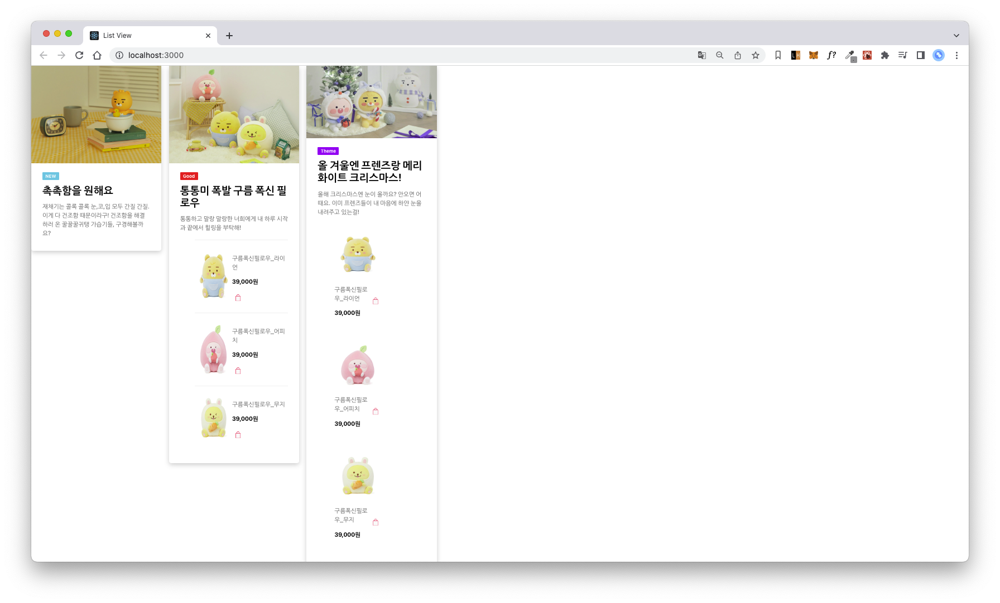

# listview-react-justcode

> 컴포넌트 재활용 실습

## 🚀 Mission

- `OriginalCardList.js, OriginalCardList.scss`를 재활용 가능한 컴포넌트들로 분리

---

촉촉함을 원해요

 

- 사진
- 카드 타입 (New)
- 타이틀
- 설명

통통미 폭발

 

- 사진
- 카드 타입 (Good)
- 타이틀
- 설명
- 연관 상품 (리스트)

올 겨울엔 프렌즈랑

 

- 사진
- 카드 타입 (Theme)
- 타이틀
- 설명
- 연관 상품 (카드)

---

